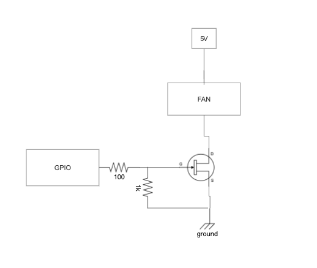

# Fan control for Raspberry Pi

This is a small project that I build in order to cool down my raspi home cluster

The case I use have some external fans to cool down the pies when it is too hot.
However, sometimes the temperature is ok and we can shutdown the fans.

You can deploy this as a binary and run directly in the raspi or if you use the raspis in a cluster using
k3s you can deploy that as a daemon set.

The service expose prometheus metrics, one for the current temperature of the system and another to check if the fan is on or off.

### Hardware

In other to use the GPIO pins to control your external fan you need to build a very small hardware to trigger the fan

Bill of material:

- 1 resistor 1k Ohms
- 1 resistor 100 Ohms
- 1 IRLZ44N transistor

